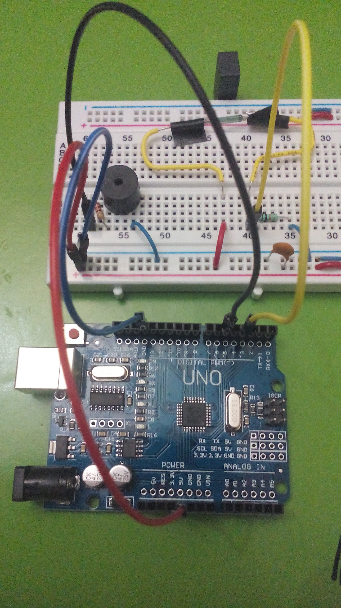

# Sistema-Alertador-de-Personas

## Introducción

> El presente proyecto, desarrolla e implementa el uso de una alarma ecológica (un Buzzer en nuestro caso),
la cual es activada por medio de un ReedSwitch (o interruptor magnético).

> Será implementada en una placa arduino UNO, reduciendo su consumo energético, y simulando 
la alarma de una puerta que permanecerá apagada cuando esté cerrada y cuando se abra, se active

## Materiales / Requisitos

* Tener instalado Git (si se desea clonar el proyecto)
* Tener instalado el IDE de Arduino (Arduino 1.8.7)
* Placa Arduino UNO
* 1 Buzzer 
* 1 Reed Switch
* Resistencias (1 de 220 Ohms y 1 de 10 KOhms)
* 1 Capacitor de 1 mF
* Jumpers y/o cables

## ¿Cómo Ejecutarlo?
* 1.- Clonamos el proyecto:
     git clone https://github.com/MrDanii/Sistema-Alertador-de-Personas.git
* 2.- En el IDE  de arduino abrimos el archivo *.ino (SAP.ino)
* 3.- En herramientas, escogemos nuestro modelo de placa
* 4.- y finalmente conectamos el arduino a la computadora y subimos el sketch

## Contribuciones

Si deseas contribuir a mejorar el proyecto de este repositorio, porfavor notifica tus cambios 
vía email a dan333@hotmail.com
El código de Conducta se adapta al [Convenio de Contribución][homepage], en la versión 1.4,
disponible en [http://contributor-covenant.org/version/1/4][version]

[homepage]: https://contributor-covenant.org
[version]: http://contributor-covenant.org/version/1/4/